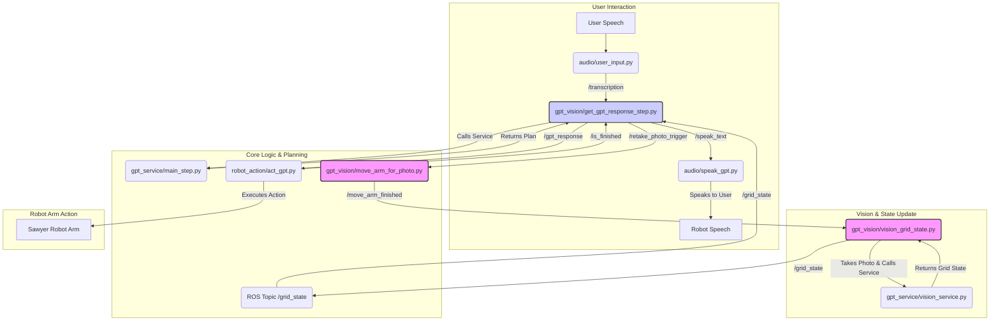

# ROS Architecture for On-Demand Photo Retaking

This document describes the required ROS architecture and implementation changes to enable the robot to take another photo of the grid on command during an ongoing task session.

## Problem Statement

During the step-by-step task execution, users may want to say "take another photo of the grid" to update the robot's understanding of the current state. The existing system only takes photos during initialization.

## Current Architecture

The existing system has these key components:
- [`audio/src/scripts/user_input.py`](src/audio/src/scripts/user_input.py) - Speech to text
- [`gpt_vision/src/scripts/get_gpt_response_step.py`](src/gpt_vision/src/scripts/get_gpt_response_step.py) - Main control logic
- [`gpt_vision/src/scripts/move_arm_for_photo.py`](src/gpt_vision/src/scripts/move_arm_for_photo.py) - Arm positioning for photos
- [`gpt_vision/src/scripts/vision_grid_state.py`](src/gpt_vision/src/scripts/vision_grid_state.py) - Photo capture and analysis
- [`robot_action/src/scripts/act_gpt.py`](src/robot_action/src/scripts/act_gpt.py) - Executes grab/place actions

## Proposed Architecture



## Implementation Flow

### Step-by-Step Process

1. **User Command**: User says "take another photo of the grid"
2. **Speech Recognition**: [`audio/src/scripts/user_input.py`](src/audio/src/scripts/user_input.py) publishes transcription to `/transcription`
3. **Intent Recognition**: [`gpt_vision/src/scripts/get_gpt_response_step.py`](src/gpt_vision/src/scripts/get_gpt_response_step.py) receives transcription and calls GPT service
4. **Service Response**: GPT service recognizes the command and returns `{"speak": "Taking a new photo", "actions": [{"action": "photo", "space": 0}]}`
5. **Photo Trigger**: [`get_gpt_response_step.py`](src/gpt_vision/src/scripts/get_gpt_response_step.py) publishes to `/retake_photo_trigger` instead of `/gpt_response`
6. **Arm Movement**: [`move_arm_for_photo.py`](src/gpt_vision/src/scripts/move_arm_for_photo.py) receives trigger and moves arm to photo position
7. **Movement Complete**: [`move_arm_for_photo.py`](src/gpt_vision/src/scripts/move_arm_for_photo.py) publishes "move_complete" to `/move_arm_finished`
8. **Photo Capture**: [`vision_grid_state.py`](src/gpt_vision/src/scripts/vision_grid_state.py) takes photo and analyzes grid state
9. **State Update**: [`vision_grid_state.py`](src/gpt_vision/src/scripts/vision_grid_state.py) publishes new grid state to `/grid_state`
10. **Resume Task**: [`get_gpt_response_step.py`](src/gpt_vision/src/scripts/get_gpt_response_step.py) receives updated state and continues with original task

## Required Code Changes

### 1. System Prompt Update

**File**: [`gpt_service/system_prompt_step.json`](gpt_service/system_prompt_step.json)

Add to the system prompt:

```json
"SPECIAL COMMANDS:
When the user requests to 'take another photo', 'retake photo', 'update grid state', or similar:
- Respond with: {\"speak\": \"I'll take a new photo to update my understanding of the grid.\", \"actions\": [{\"action\": \"photo\", \"space\": 0}]}
- This will trigger the photo sequence without affecting the main task flow."
```

### 2. Main Control Logic Update

**File**: [`gpt_vision/src/scripts/get_gpt_response_step.py`](src/gpt_vision/src/scripts/get_gpt_response_step.py)

**Changes needed**:
- Add publisher for `/retake_photo_trigger` topic
- Modify `_handle_service_response()` method to detect "photo" action
- When "photo" action detected, publish trigger instead of sending to `act_gpt.py`

**Code additions**:
```python
# In __init__:
self.photo_trigger_pub = rospy.Publisher('/retake_photo_trigger', String, queue_size=10)

# In _handle_service_response():
if self.current_logical_step_primitive_actions:
    # Check if this is a photo action
    if (len(self.current_logical_step_primitive_actions) == 1 and 
        self.current_logical_step_primitive_actions[0].get("action") == "photo"):
        rospy.loginfo("Photo action detected, triggering photo sequence")
        self.photo_trigger_pub.publish("take_photo")
        self.waiting_for_confirmation_for_logical_step = False
        # Don't set executing_primitive_actions_sequence = True for photo actions
        return
```

### 3. Arm Movement Script Update

**File**: [`gpt_vision/src/scripts/move_arm_for_photo.py`](src/gpt_vision/src/scripts/move_arm_for_photo.py)

**Changes needed**:
- Convert from standalone script to persistent node
- Add subscriber for `/retake_photo_trigger` topic
- Move existing movement logic into callback function

**Code structure**:
```python
#!/usr/bin/env python

import rospy
from std_msgs.msg import String
# ... existing imports

class MoveArmForPhotoNode:
    def __init__(self):
        rospy.init_node('move_arm_for_photo_node')
        
        # Subscribe to photo trigger
        rospy.Subscriber('/retake_photo_trigger', String, self.photo_trigger_callback)
        
        # Publisher for completion notification
        self.completion_pub = rospy.Publisher('/move_arm_finished', String, queue_size=10)
        
        rospy.loginfo("Move arm for photo node ready")

    def photo_trigger_callback(self, msg):
        rospy.loginfo("Received photo trigger, moving arm to position")
        self.move_to_photo_position()

    def move_to_photo_position(self):
        # Move existing main() logic here
        # ... arm movement code ...
        
        # Publish completion
        self.completion_pub.publish("move_complete")

if __name__ == '__main__':
    try:
        node = MoveArmForPhotoNode()
        rospy.spin()
    except rospy.ROSInterruptException:
        pass
```

### 4. Vision Grid State Script

**File**: [`gpt_vision/src/scripts/vision_grid_state.py`](src/gpt_vision/src/scripts/vision_grid_state.py)

**Changes needed**: 
- Modify to handle multiple photo requests in same session
- Remove `rospy.signal_shutdown()` call that terminates after one photo
- Keep node running to handle subsequent photo requests

**Key modification**:
```python
# In callback() function, replace:
# rospy.signal_shutdown('Photo processed and analyzed successfully.')

# With:
rospy.loginfo('Photo processed and analyzed successfully. Ready for next request.')
```

### 5. Launch File Update

**File**: [`gpt_vision/launch/complete_system_step.launch`](src/gpt_vision/launch/complete_system_step.launch)

Update the move_arm_for_photo node to run persistently:

```xml
<!-- Move arm to photo position (persistent node) -->
<node name="move_arm_for_photo_node" pkg="gpt_vision" type="move_arm_for_photo.py" output="screen"/>
```

## New ROS Topics

| Topic Name | Type | Publisher | Subscriber | Purpose |
|------------|------|-----------|------------|---------|
| `/retake_photo_trigger` | `std_msgs/String` | `get_gpt_response_step.py` | `move_arm_for_photo.py` | Triggers photo sequence |

## Testing Plan

1. **Unit Testing**: Test each modified component individually
2. **Integration Testing**: 
   - Start with normal task execution
   - Issue "take another photo" command mid-task
   - Verify arm moves, photo is taken, grid state updates
   - Confirm task resumes with updated state
3. **Edge Case Testing**:
   - Multiple photo requests in succession
   - Photo request during arm movement
   - Photo request during action execution

## Benefits

- **Non-disruptive**: Photo requests don't interrupt ongoing tasks
- **Seamless integration**: Uses existing ROS communication patterns
- **Minimal changes**: Leverages existing vision and movement infrastructure
- **User-friendly**: Natural voice command interface
- **Robust**: Maintains task state and continues after photo update

## Considerations

- **Timing**: Ensure photo sequence completes before resuming main task
- **Error handling**: What if photo fails or arm movement fails?
- **State management**: Preserve task context during photo sequence
- **Resource usage**: Camera and arm usage coordination